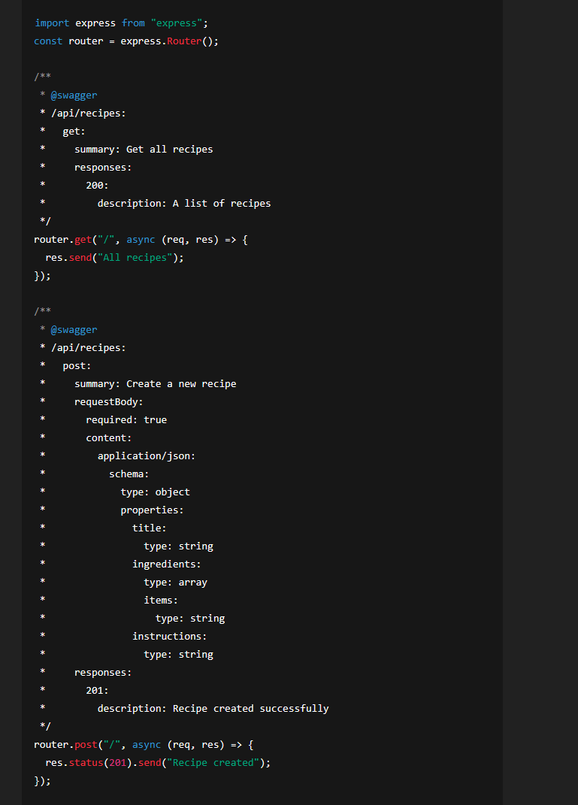

# Swagger UI

The setup for **Swagger UI** is designed to make the project easier to understand, test, and extend in future implementations.  
It allows users and developers to validate and explore the project's different endpoints in a visual and intuitive way.

The Swagger documentation for routes and HTTP methods could be placed directly inside the `src` folder.  
However, to maintain a clear separation between application code and Swagger implementation, it is better to **centralize the Swagger setup** in a dedicated folder—similar to how testing files are organized.  

This structure mirrors the organization of the `src` project so that if additional `openapi.yaml` files are added later, it will be easier to identify which file or subproject each documentation file belongs to.

---

# Setup

The base setup is already prepared through the existing `package.json` and `package-lock.json` files.  
However, for new installations, it’s helpful to document what needs to be done to set up Swagger UI properly for future developers.

### 1. Install the required dependencies

Depending on how you want to manage Swagger documentation, there are two main approaches:

- **Option A: Inline (within route files)**  
  Swagger documentation can be added directly in the route files using JSDoc-style comments.  
  Example:  
    
  For this setup, install the following packages:
  ```bash
  npm install swagger-jsdoc swagger-ui-express
  ```
- **Option B: External YAML file (recommended)**  
    The current project uses this approach. The Swagger documentation is defined in a centralized `openapi.yaml` file.
    To support this method, install:
    ```bash
    npm install swagger-ui-express yamljs  
    ```
### 2. Create the `swaggerConfig.js` file

This file provides the general structure and configuration for hosting the Swagger UI documentation.

### 3. Set up the configuration and run the project

This configuration is currently implemented in the `app.js` file.

```js
    // ----------------- Setup Swagger UI -----------------
    // This runs on http://localhost:5000/api-docs
    import swaggerUi from "swagger-ui-express";
    import YAML from "yamljs";

    const swaggerDocument = YAML.load("../swagger/openapi.yaml");
    app.use("/api-docs", swaggerUi.serve, swaggerUi.setup(swaggerDocument));
```
- It is important to set the correct file path in `YAML.load()` to match the location of your `openapi.yaml` documentation file. For example, if the file is stored inside a `swagger` or `docs` folder, make sure the relative path points there accurately.

- The `/api-docs` route defines where the Swagger UI documentation can be accessed (e.g., [http://localhost:5000/api-docs](http://localhost:5000/api-docs)). You can rename this route to something else—such as `/docs` or `/swagger`—depending on your project’s structure or naming preferences.

### 4. Create the `openapi.yaml` file

The `openapi.yaml` file serves as the core of your API documentation. It defines how each endpoint behaves and what inputs or outputs are expected.

- The file should contain **individual routes** for all your API endpoints, organized under the appropriate paths (e.g., `/api/recipes`, `/api/tasks`, etc.).  
- Each route should include detailed **descriptions** explaining:
  - What the endpoint does  
  - What parameters or data are required to make the request  
  - What responses are returned (including status codes and example payloads)

This structured documentation helps both developers and testers easily understand how to interact with your API and ensures consistent communication between frontend and backend teams.


